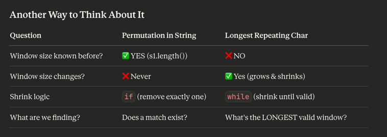

Code Pattern Comparison
Pattern 1: Variable-Size Window
java

int left = 0;
Set<Character> window = new HashSet<>();

for (int right = 0; right < s.length(); right++) {
char c = s.charAt(right);

    // Shrink UNTIL valid (might be multiple times)
    while (/* window is invalid */) {  // ← WHILE
        window.remove(s.charAt(left));
        left++;
    }
    
    window.add(c);
    // Window size varies: (right - left + 1)
}
Key: while keeps shrinking until condition met

Pattern 2: Fixed-Size Window
javaint windowSize = k;  // Fixed size!
Map<Character, Integer> window = new HashMap<>();

for (int right = 0; right < s.length(); right++) {
// Add to window
window.put(s.charAt(right), window.getOrDefault(s.charAt(right), 0) + 1);

    // Remove from left IF window too big (only once)
    if (right >= windowSize) {  // ← IF (not WHILE!)
        char leftChar = s.charAt(right - windowSize);
        window.put(leftChar, window.get(leftChar) - 1);
        if (window.get(leftChar) == 0) {
            window.remove(leftChar);
        }
    }
    
    // Window size is always: min(right + 1, windowSize)
}

Do we know the window size BEFORE we start?

├── YES → Fixed-Size Window
│   └── Use IF to remove one element
│   └── Example: Permutation in String (size = s1.length())
│
└── NO → Variable-Size Window
└── Use WHILE to shrink until valid
└── Example: Longest Substring (shrink until no duplicate)
└── Example: Longest Repeating Char (shrink until replacements ≤ k)

